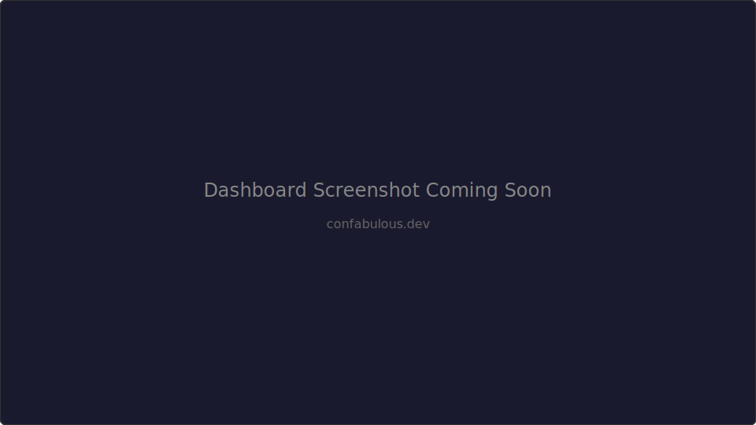

# Confabulous

Self-hosted analytics for your Claude Code sessions.

[](https://github.com/ConfabulousDev/confab-web)
[](https://ghcr.io/confabulousdev/confab-web)
[](LICENSE)



**Open-source, self-hosted** platform for archiving, searching, and analyzing your Claude Code sessions. Runs entirely in Docker on **your own infrastructure**.

> [!IMPORTANT]
> Code sessions contain proprietary code, architecture decisions, and internal workflows. Confabulous keeps all of it on your network — no third-party access, no vendor lock-in.

## Quickstart

**Prerequisites:** Docker and Docker Compose

### Start the Stack

```bash
docker compose up -d
```

Open [http://localhost:8080](http://localhost:8080) — log in with `admin@local.dev` / `localdevpassword`.

### Connect the CLI

Install the [Confab CLI](https://github.com/ConfabulousDev/confab):

```bash
curl -fsSL http://localhost:8080/install | bash
confab setup --backend-url http://localhost:8080
```

Start a Claude Code session — it appears in the dashboard automatically.

## Features

- **Session Management** — Archive, browse, search sessions; full transcript viewer
- **Analytics & Smart Recaps** (optional) — Cost tracking, AI-powered recaps (requires Anthropic API key)
- **Sharing** — Public and private share links
- **Multi-User Auth** — Password auth, GitHub OAuth, Google OAuth, or OIDC (Okta, Auth0, Azure AD, Keycloak)
- **Team Sharing** — Shared-session mode makes all sessions visible to authenticated team members
- **White-Label** — Disable footer branding and cookie banners for internal deployments
- **Admin Panel** — User management, activation/deactivation, storage monitoring
- **Developer Experience** — GitHub link detection, API keys, per-user rate limiting
- **Infrastructure** — Single Docker image (frontend + backend), Docker Compose one-command deploy, PostgreSQL + MinIO, custom domain support

## Architecture

```
┌──────────────────────┐
│     Confab CLI       │  ← Runs on developer's machine
│                      │    Captures sessions via Claude Code hook
│  ~/.confab/          │    Uploads to your Confabulous server
└──────────┬───────────┘
           │ HTTP/HTTPS
           ▼
┌─────────────────────────────────────────┐
│  Self-Hosted Stack (docker compose)     │
│                                         │
│  ┌─────────────┐  ┌─────────────────┐  │
│  │  Backend    │  │  React Frontend │  │
│  │  (Go API)   │  │  (Dashboard)    │  │
│  └──────┬──────┘  └─────────────────┘  │
│         │                               │
│  ┌──────┴──────┐  ┌─────────────────┐  │
│  │ PostgreSQL  │  │  MinIO (S3)     │  │
│  └─────────────┘  └─────────────────┘  │
└─────────────────────────────────────────┘
```

## Configuration

Environment variables are set in `docker-compose.yml`. See [CONFIGURATION.md](CONFIGURATION.md) for the full reference.

Admin panel is at `/admin/users`. Grant access via `SUPER_ADMIN_EMAILS` in `docker-compose.yml`.

## Cloud Deployment

Fly.io is the tested cloud deployment option. See [backend/README.md](backend/README.md) for instructions.

## Development

For contributors with hot-reload:

```bash
# Start databases only
docker compose up -d postgres minio minio-setup migrate

# Backend (requires Go 1.21+)
cp backend/.env.example backend/.env
cd backend && go run cmd/server/main.go

# Frontend (requires Node.js 18+)
cd frontend && npm install && npm run dev
```

### Running Tests

```bash
# Backend unit tests (fast)
cd backend && go test -short ./...

# Backend integration tests (requires Docker)
cd backend && go test ./...

# Frontend tests
cd frontend && npm test
```

### Project Structure

```
confab-web/
├── docker-compose.yml     # Local development stack
├── CONFIGURATION.md       # Full configuration reference
├── backend/               # Backend service (Go)
│   ├── cmd/server/       # Server entry point
│   ├── internal/         # Internal packages
│   │   ├── api/         # HTTP handlers
│   │   ├── auth/        # OAuth & API keys
│   │   ├── db/          # PostgreSQL layer
│   │   ├── storage/     # MinIO/S3 client
│   │   └── testutil/    # Test infrastructure
│   └── README.md
│
└── frontend/              # React web dashboard
    ├── src/pages/        # Pages and routes
    ├── src/services/     # API client
    └── README.md
```

See also: [Confab CLI](https://github.com/ConfabulousDev/confab) (separate repo)

## License

[MIT](LICENSE)
