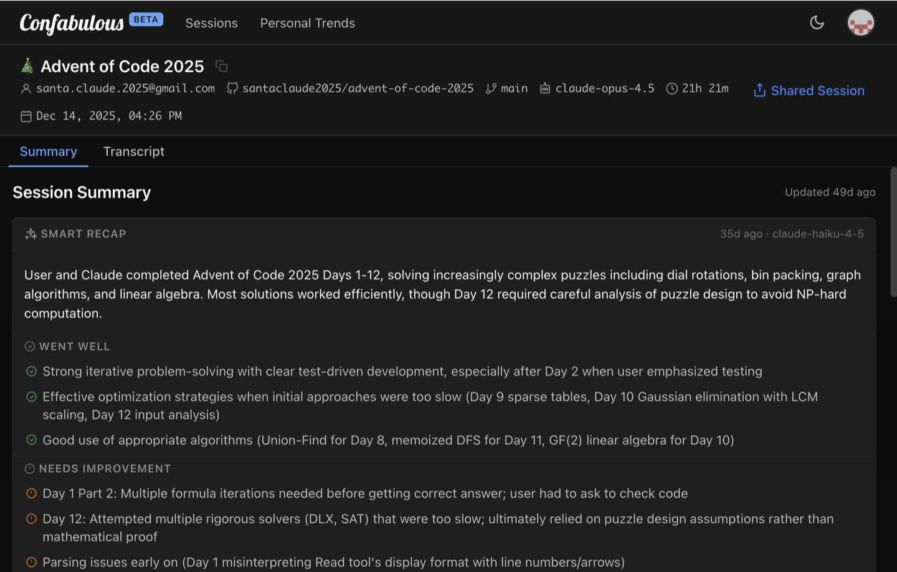
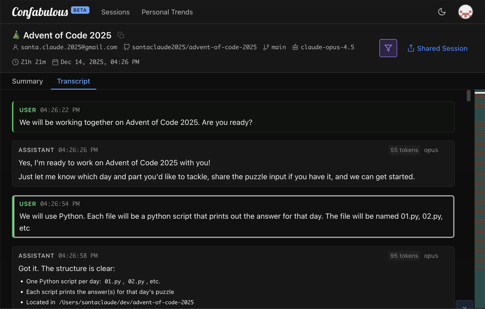
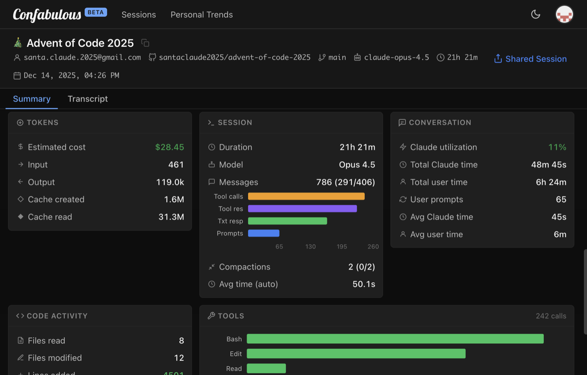
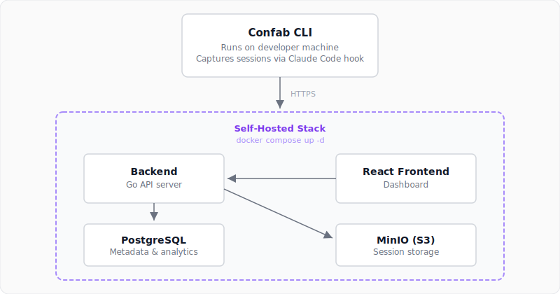

# Confabulous

Self-hosted analytics for your Claude Code sessions.

[](https://github.com/ConfabulousDev/confab-web)
[](https://ghcr.io/confabulousdev/confab-web)
[](LICENSE)

<table>
<tr>
<td align="center">

<br/><b>Session Summary</b>
</td>
<td align="center">

<br/><b>Transcript</b>
</td>
<td align="center">

<br/><b>Analytics</b>
</td>
</tr>
</table>

**Open-source, self-hosted** platform for archiving, searching, and analyzing your Claude Code sessions. Runs entirely in Docker on **your own infrastructure**.

> [!IMPORTANT]
> Code sessions contain proprietary code, architecture decisions, and internal workflows. The self hosted Confabulous stack keeps all of it on your network — no third-party access, no vendor lock-in.

## Quickstart

**Prerequisites:** Docker and Docker Compose

### Start the Stack

```bash
docker compose up -d
```

Open [http://localhost:8080](http://localhost:8080) — log in with `admin@local.dev` / `localdevpassword`.

### Connect the CLI

Install the [Confab CLI](https://github.com/ConfabulousDev/confab):

```bash
curl -fsSL https://raw.githubusercontent.com/ConfabulousDev/confab/main/install.sh | bash
```

Point it at your server:

```bash
confab setup --backend-url http://localhost:8080
```

Start a Claude Code session — it appears in the dashboard automatically.

## Features

- **Session Management** — Archive, browse, search sessions; full transcript viewer
- **Analytics & Smart Recaps** — Cost tracking, AI-powered recaps (requires Anthropic API key)
- **Sharing** — Fine-grained session-by-session sharing, or open sharing policy for self-hosted high-trust deployments
- **Multi-User Auth** — Password auth, GitHub OAuth, Google OAuth, or OIDC (Okta, Auth0, Azure AD, Keycloak)
- **Admin Panel** — User management, activation/deactivation, storage monitoring
- **Developer Experience** — GitHub link detection, API keys, per-user rate limiting
- **Infrastructure** — Single Docker image (frontend + backend), Docker Compose one-command deploy, PostgreSQL + MinIO, custom domain support

## How It Works



## Self-Hosting

See the [Self-Hosting Guide](SELF-HOSTING.md) for complete deployment instructions including HTTPS setup, authentication options, and production hardening.

## Configuration

Configuration is simple — everything is controlled through environment variables in `docker-compose.yml`. See [CONFIGURATION.md](CONFIGURATION.md) for the full reference.

## Cloud Deployment

The official SaaS instance lives at [confabulous.dev](https://confabulous.dev), hosted on a Fly.io / Neon.tech stack. See [`deploy-to-fly.sh`](deploy-to-fly.sh) and [`fly.toml`](fly.toml) for details.

## Dev Setup

```bash
# Start databases only
docker compose up -d postgres minio minio-setup migrate

# Backend (requires Go 1.21+)
cp backend/.env.example backend/.env
cd backend && go run cmd/server/main.go

# Frontend with hot-reload (requires Node.js 18+)
cd frontend && npm install && npm run dev
```

### Running Tests

```bash
# Backend unit tests (fast)
cd backend && go test -short ./...

# Backend integration tests (requires Docker)
cd backend && go test ./...

# Frontend tests
cd frontend && npm test
```

### Project Structure

```
confab-web/
├── docker-compose.yml     # Local development stack
├── CONFIGURATION.md       # Full configuration reference
├── backend/               # Backend service (Go)
│   ├── cmd/server/       # Server entry point
│   ├── internal/         # Internal packages
│   │   ├── api/         # HTTP handlers
│   │   ├── auth/        # OAuth & API keys
│   │   ├── db/          # PostgreSQL layer
│   │   ├── storage/     # MinIO/S3 client
│   │   └── testutil/    # Test infrastructure
│   └── README.md
│
└── frontend/              # React web dashboard
    ├── src/pages/        # Pages and routes
    ├── src/services/     # API client
    └── README.md
```

See also: [Confab CLI](https://github.com/ConfabulousDev/confab) (separate repo)

## License

[MIT](LICENSE)
