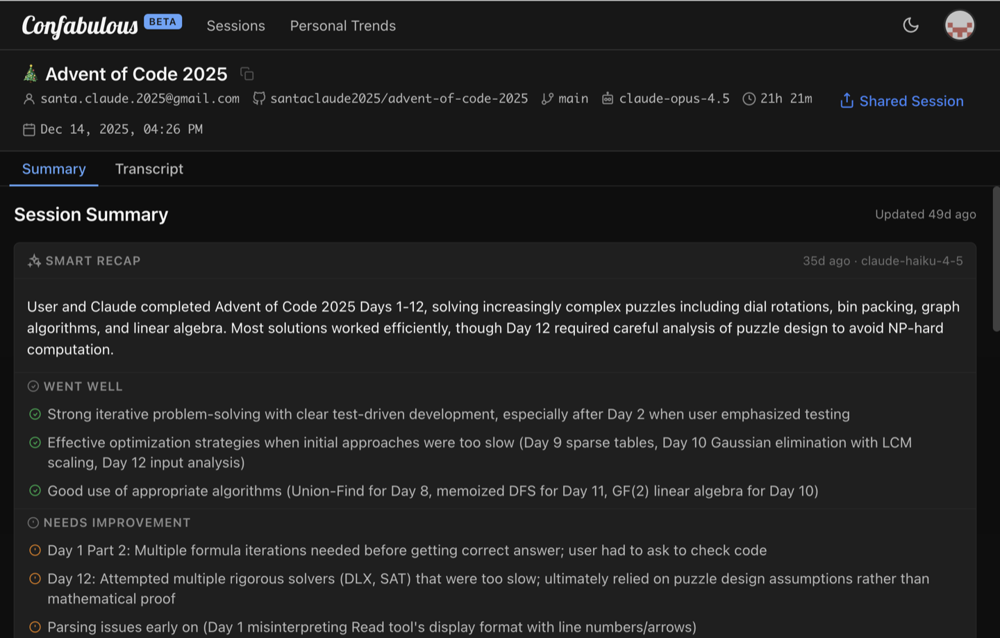
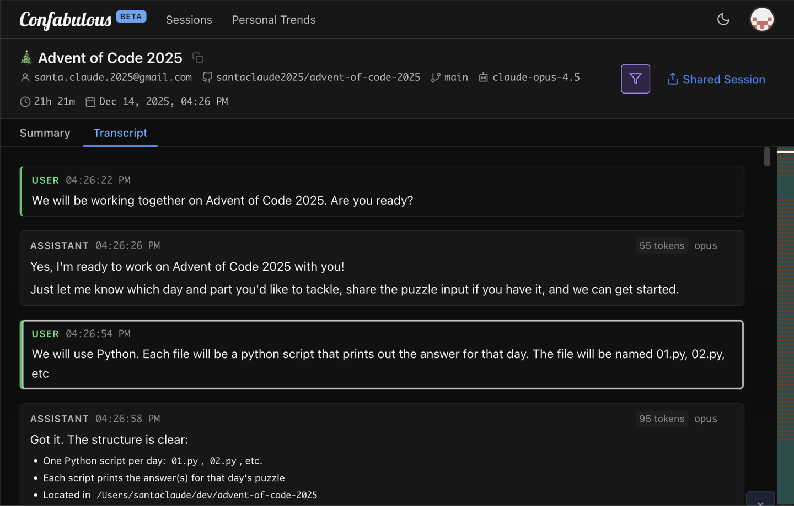
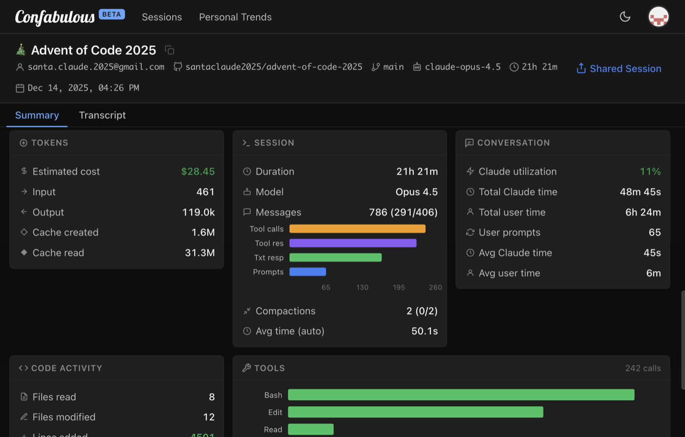
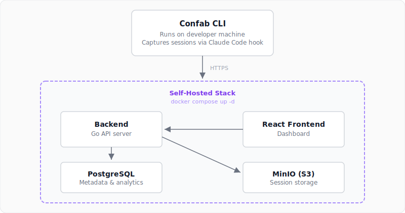

# Confabulous

Self-hosted analytics for your Claude Code and Codex sessions.

[](https://github.com/ConfabulousDev/confab-web)
[](https://ghcr.io/confabulousdev/confab-web)
[](LICENSE)

<table>
<tr>
<td align="center">

<br/><b>Session Summary</b>
</td>
<td align="center">

<br/><b>Transcript</b>
</td>
<td align="center">

<br/><b>Analytics</b>
</td>
</tr>
</table>

**Open-source, self-hosted** platform for archiving, searching, and analyzing your Claude Code and Codex sessions. Runs entirely in Docker on **your own infrastructure**.

> [!IMPORTANT]
> Code sessions contain proprietary code, architecture decisions, and internal workflows. The self hosted Confabulous stack keeps all of it on your network — no third-party access, no vendor lock-in.

> [!TIP]
> **No login required** — see Confabulous in action at **[demo.confabulous.dev](https://demo.confabulous.dev)**.

> [!TIP]
> **Don't want to self-host?** Use the **free, fully featured** managed instance at **[confabulous.dev](https://confabulous.dev)** — no install required.

## Quickstart

Run your own instance in under a minute with the [Self-Hosting Guide](SELF-HOSTING.md#quickstart): one `docker-compose.yml`, `docker compose up -d`, and the dashboard is live at [http://localhost:8080](http://localhost:8080) (`admin@local.dev` / `localdevpassword`).

Developing against the code? See [Local Development](#local-development).

### Connect the CLI

Install the [Confab CLI](https://github.com/ConfabulousDev/confab) and point it at your instance:

```bash
curl -fsSL https://raw.githubusercontent.com/ConfabulousDev/confab/main/install.sh | bash
confab setup --backend-url http://localhost:8080
```

Start a Claude Code or Codex session — it appears in the dashboard automatically.

## Features

- **Session Management** — Archive, browse, search sessions; full transcript viewer
- **Analytics & Smart Recaps** — Cost tracking, AI-powered recaps (requires Anthropic API key)
- **Sharing** — Fine-grained session-by-session sharing, or open sharing policy for self-hosted high-trust deployments
- **Multi-User Auth** — Password auth, GitHub OAuth, Google OAuth, or OIDC (Okta, Auth0, Azure AD, Keycloak)
- **Admin Panel** — User management, activation/deactivation, storage monitoring
- **Developer Experience** — GitHub link detection, API keys, per-user rate limiting
- **Infrastructure** — Single Docker image (frontend + backend), Docker Compose one-command deploy, PostgreSQL + MinIO, custom domain support

## How It Works



## Self-Hosting

See the [Self-Hosting Guide](SELF-HOSTING.md) for complete deployment instructions including HTTPS setup, authentication options, and production hardening.

## Configuration

Configuration is simple — everything is controlled through environment variables. See [CONFIGURATION.md](CONFIGURATION.md) for the full reference.

## Deploying to a Cloud Host

Two production reference deployments:

- **Linode + Docker Compose + Caddy** — [`confab-demo-site`](https://github.com/ConfabulousDev/confab-demo-site) (OpenTofu, compose, Caddyfile, deploy script) powers [demo.confabulous.dev](https://demo.confabulous.dev) for $7/mo.
- **Fly.io + Neon** — [`deploy-to-fly.sh`](deploy-to-fly.sh) and [`fly.toml`](fly.toml) power [confabulous.dev](https://confabulous.dev).

## Developer Docs

### Project Guides

- [`CLAUDE.md`](CLAUDE.md) -- Development workflow, testing, coding conventions
- [`CONFIGURATION.md`](CONFIGURATION.md) -- Full environment variable reference
- [`SELF-HOSTING.md`](SELF-HOSTING.md) -- Deployment, HTTPS, auth setup, production hardening

### Backend

- [`backend/API.md`](backend/API.md) -- REST API reference (endpoints, request/response schemas, auth)
- [`backend/internal/README.md`](backend/internal/README.md) -- Package index, dependency map, data flow, layering rules

### Frontend

- [`frontend/src/README.md`](frontend/src/README.md) -- Module index, data flow, architectural patterns

## Local Development

One path: infra in Docker, backend and frontend native for hot reload. Everything runs through the root `Makefile` — `make help` lists every target.

**Prerequisites:** Docker & Docker Compose, Go 1.26+, Node.js 24+.

```bash
make setup    # first run only: creates backend/.env, installs frontend deps
make dev      # infra + backend + frontend in one terminal (Ctrl-C stops all)
```

Open [http://localhost:5173](http://localhost:5173) and log in with `admin@example.com` / `change-me-immediately` (from `backend/.env`).

Prefer separate terminals? Run the pieces on their own:

```bash
make up         # infra (Postgres + MinIO) + migrations
make backend    # backend → http://localhost:8080
make frontend   # frontend → http://localhost:5173
```

### Running Tests

```bash
make test       # backend + frontend
make coverage   # backend coverage (sharded)
```

### Project Structure

```
confab-web/
├── docker-compose.yml     # Local dev infrastructure (Postgres + MinIO + migrate)
├── CONFIGURATION.md       # Full configuration reference
├── backend/               # Backend service (Go)
│   ├── cmd/server/       # Server entry point
│   ├── internal/         # Internal packages
│   │   ├── api/         # HTTP handlers
│   │   ├── auth/        # OAuth & API keys
│   │   ├── db/          # PostgreSQL layer
│   │   ├── storage/     # MinIO/S3 client
│   │   └── testutil/    # Test infrastructure
│   └── README.md
│
└── frontend/              # React web dashboard
    ├── src/pages/        # Pages and routes
    ├── src/services/     # API client
    └── README.md
```

See also: [Confab CLI](https://github.com/ConfabulousDev/confab) (separate repo)

## License

[MIT](LICENSE)
